# 🛒 Full Stack E-Commerce Website (MERN)

## 📌 Description

This is a **full-stack E-Commerce web application** built using the **MERN stack (MongoDB, Express.js, React.js, Node.js)**.

It allows users to browse products, add items to cart, and place orders. It also includes an **admin panel** for managing products and orders.

---

## 🚀 Features

### 👤 User Features

* Browse products
* Add to cart
* Place orders
* Payment integration (Cash on delivery)
* View order history

### 🛠️ Admin Features

* Add / delete products
* Manage orders

---

## 🛠️ Tech Stack

* Frontend: React.js (Vite)
* Backend: Node.js, Express.js
* Database: MongoDB
* Cloud: Cloudinary

---

## 📂 Project Structure

```
E-Commerce-website/
│── frontend/        # React (Vite)
│── backend/         # Express API
│── admin/           # Admin Panel
│── README.md
```

---

# ⚙️ Complete Setup Guide

## 🔽 1. Clone the Repository

```bash
git clone https://github.com/harshitgawli/E-Commerce-website.git
cd E-Commerce-website
```

---

## 📦 2. Install Dependencies

### Backend

```bash
cd backend
npm install
```

### Frontend

```bash
cd ../frontend
npm install
```

### Admin Panel

```bash
cd ../admin
npm install
```

---

## 🔑 3. Environment Variables Setup

### 👉 Backend (`backend/.env`)

Create a `.env` file inside backend folder:

```env
PORT=4000

MONGO_URI=your_mongodb_connection_string

CLOUDINARY_API_KEY=your_api_key
CLOUDINARY_SECRET_KEY=your_secret
CLOUDINARY_NAME=your_cloud_name

JWT_SECRET=your_secret_key

ADMIN_EMAIL=your_admin_email
ADMIN_PASSWORD=your_admin_password
```

---

### 👉 Frontend (`frontend/.env`)

Create a `.env` file inside frontend folder:

```env
VITE_BACKEND_URL=http://localhost:4000
```

---

### 👉 Admin (`admin/.env`) 

```env
VITE_BACKEND_URL=http://localhost:4000
```

---

## ▶️ 4. Run the Project

### Start Backend

```bash
cd backend
npm run server
```

OR

```bash
npm start
```

---

### Start Frontend

```bash
cd frontend
npm run dev
```

---

### Start Admin Panel

```bash
cd admin
npm run dev
```

---

## 🌐 Default URLs

* Frontend: http://localhost:5173
* Admin Panel: http://localhost:5174 
* Backend API: http://localhost:4000

---

## ⚠️ Important Notes

* Make sure MongoDB Atlas is connected
* Use `.env.example` for sharing variables

---

## 📸 Screenshots

HOME PAGE :
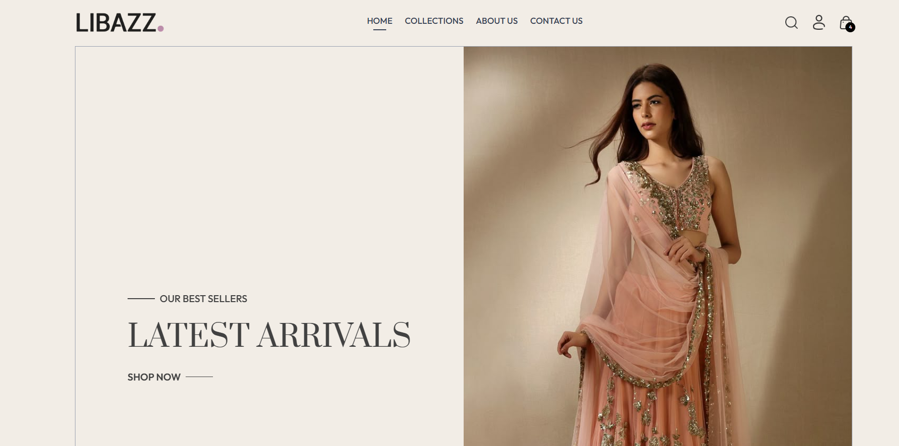
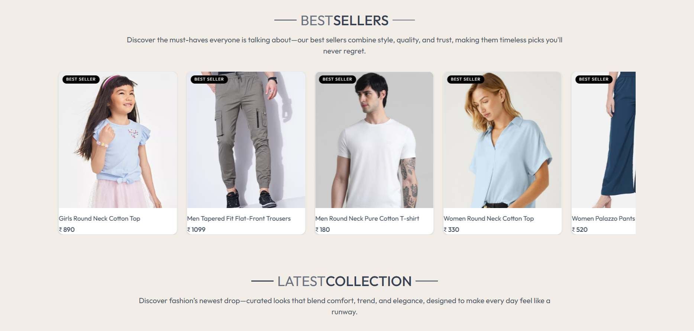
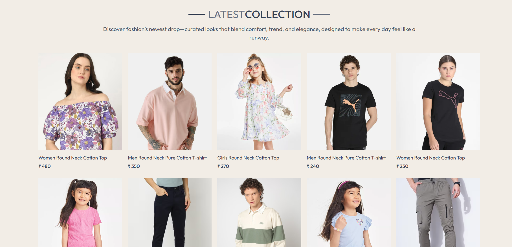
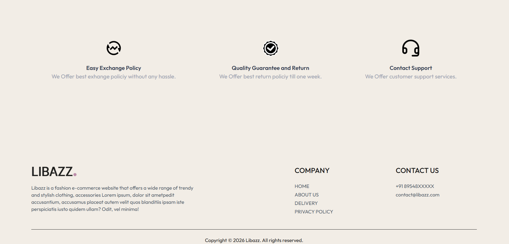
---

COLLECTION PAGE:
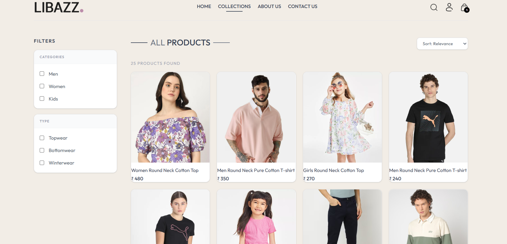

PRODUCT PAGE:
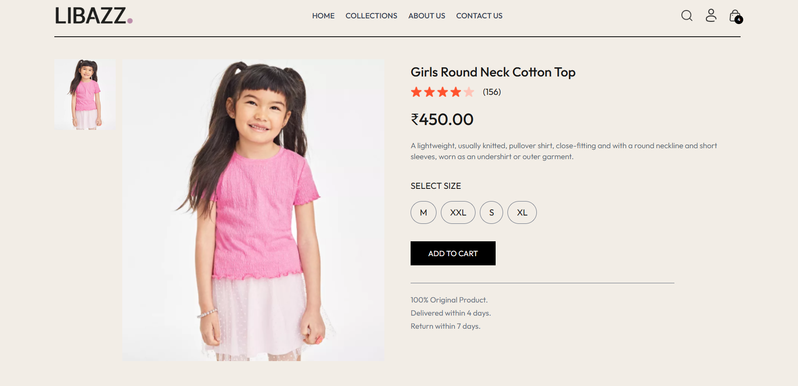

CART PAGE:
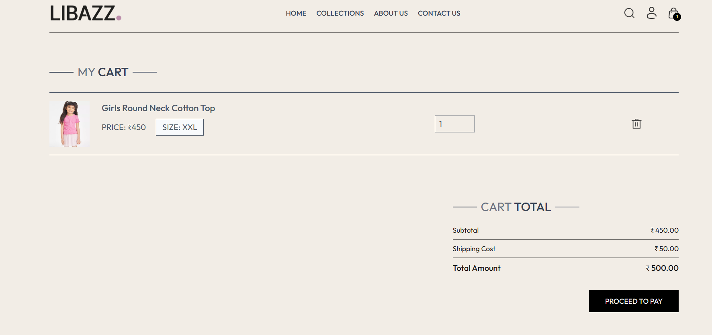

PLACE ORDER PAGE:
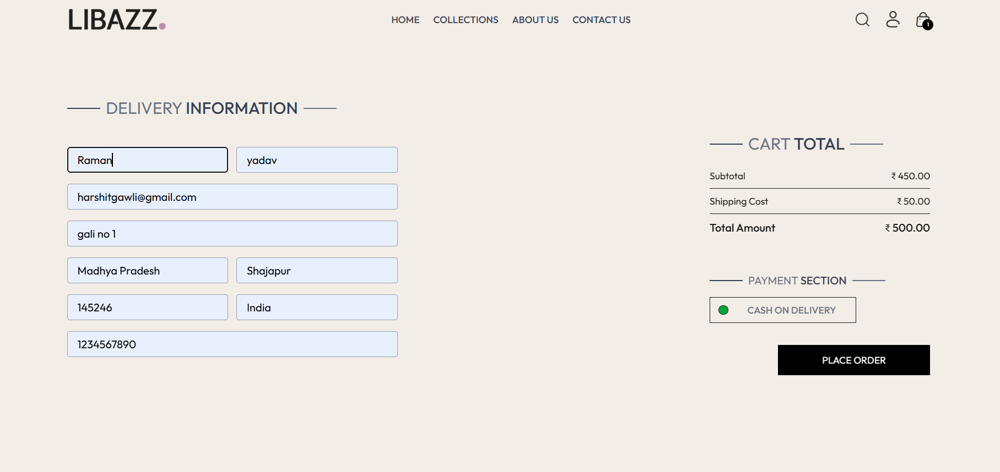

MY ORDER PAGE:
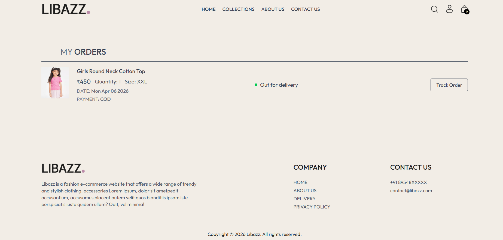

ADMIN HOME PAGE:
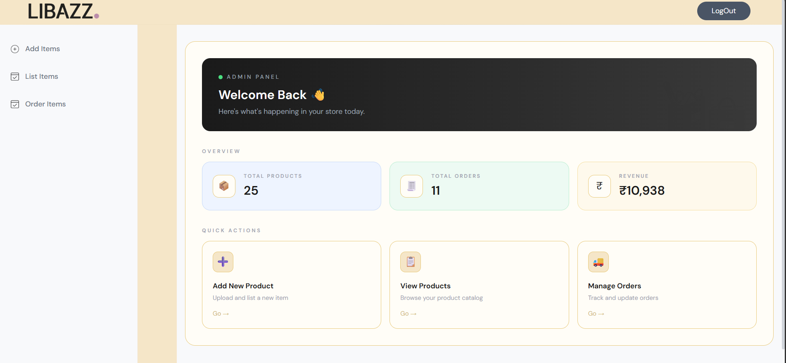

ADMIN ADD PRODUCT PAGE:
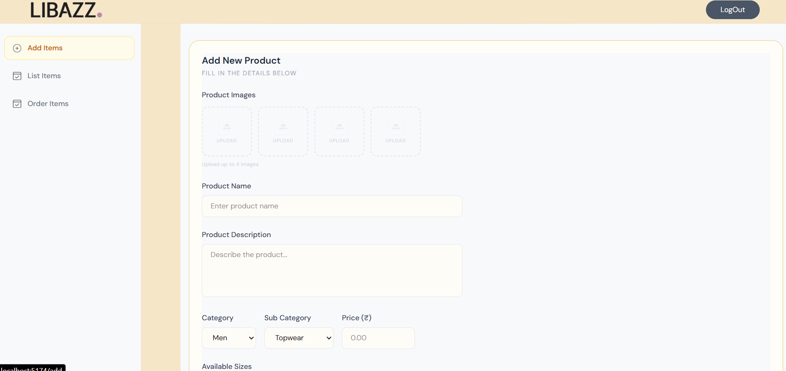

ADMIN LIST PRODUCT PAGE:
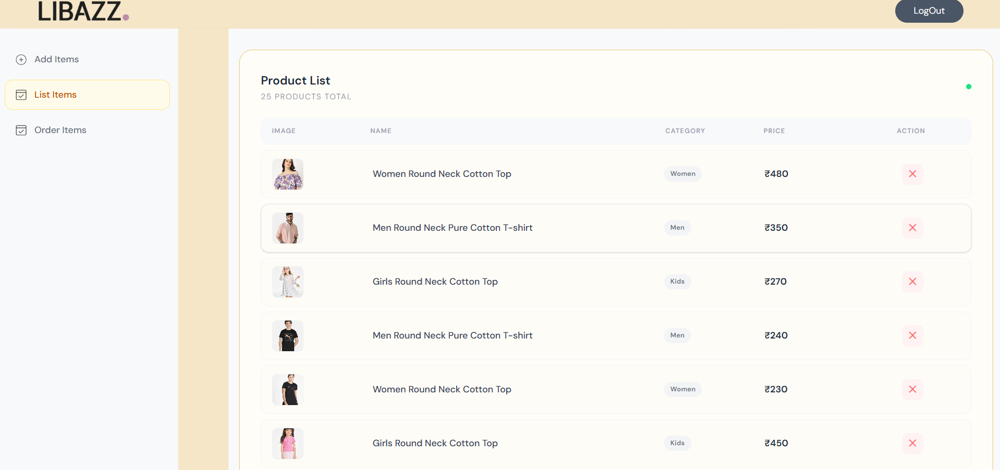

ADMIN ORDERS PAGE:
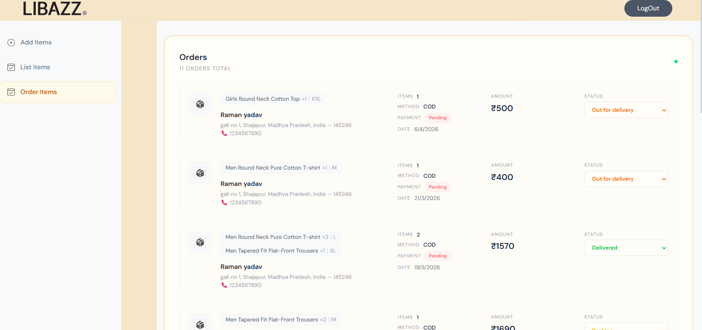
## 🚧 Future Improvements

* Authentication improvements
* Wishlist feature
* Order tracking
* UI enhancements

---

## 👨‍💻 Author

Harshit Gawli
GitHub: https://github.com/harshitgawli

---

## ⭐ Support

If you like this project, give it a ⭐ on GitHub
